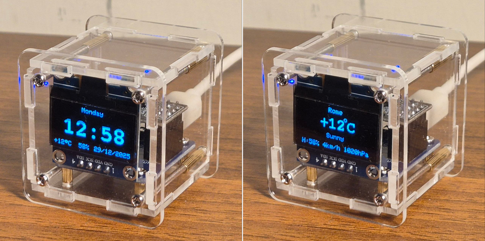
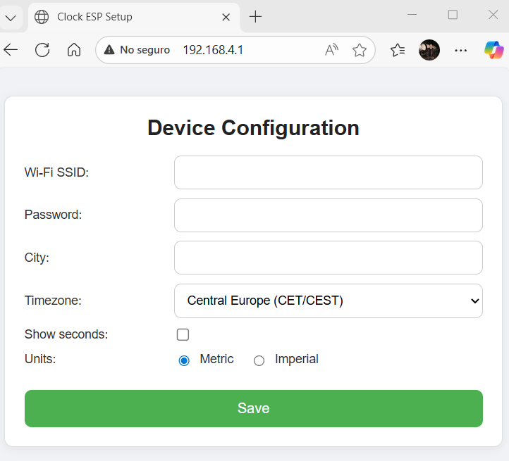
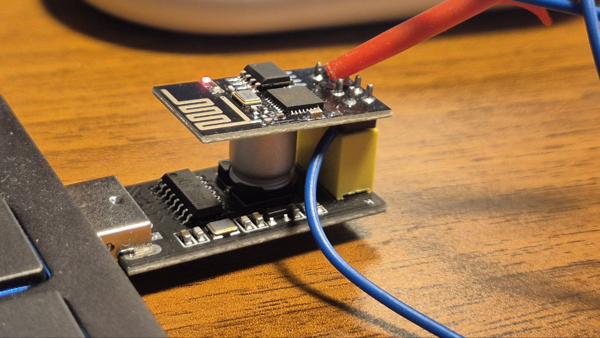

# DIY-Weather-Clock-Firmware

Firmware for the DIY Weather Clock WiFi kit that can be easily found on Amazon
or AliExpress. The kit includes a plexiglass structure and three PCB boards:

- An ESP-01S module with an ESP8266 MCU
- An Adafruit OLED display (0.96", 128x64 px)
- An interface PCB that is usually hand-soldered

 Clock Face on the left, Weather face on the right

## Why
This kit already ships with a ready-to-use firmware, but it requires registering
on an external website and you have no real control over what the firmware does
or what data it sends.

In the original WHYNOT blog you can find more information about this kit and its
firmware. This project started as a fork of that firmware, and has been heavily
modified and cleaned up to:

- remove external dependencies
- fix several corner cases
- add proper configuration and robustness
- support metric / imperial units
- support real automatic daylight-saving time (DST)

## How it works

On first boot, the firmware looks for a magic signature in EEPROM.

If the signature is not found:
- The device starts in Access Point (AP) mode
- The OLED shows connection instructions
- You connect to the AP and open the configuration web portal
- You configure:
  - Wi-Fi credentials
  - City (used for weather)
  - Timezone (preset or manual)
  - Metric / imperial units
  - Seconds display

 Configuration web screenshot

Once configured and rebooted:

- The clock connects to your Wi-Fi network
- Time is synchronized using NTP pool servers
- Timezone handling uses proper DST rules (not fixed offsets)
- Weather data is retrieved from wttr.in every 15 minutes

Every 15 seconds the display toggles between:
- Clock view
- Weather view

If weather retrieval fails (no internet, server down, etc.), the device keeps
showing the clock only.

If the internet goes away for hours and later comes back, the ESP reconnects
automatically without rebooting.

## Changes from the original firmware

- Metric / Imperial units selection
- Proper timezone handling with automatic DST
- Optional seconds display
- Support for cities with spaces and special characters
- Robust Wi-Fi reconnection
- Weather hidden when not available
- Cleaner EEPROM layout with versioned signature
- Much more predictable and debuggable behavior

## What you need to compile and install

Hardware:

- You can use a generic FTDI adapter, but it MUST be set to 3.3V
  (never use 5V, you will kill the ESP-01)
- Much easier: use an ESP-01 USB adapter
- To flash the firmware, the ESP must be in UART flash mode:
  - GPIO0 connected to GND during power-up
- Some ESP-01 boards (if you don't use the original) do not include a pull-up on GPIO2
  - This can cause random behavior when installed on the Clock.
  - Fix: solder a 12 kΩ pull-up resistor between GPIO2 and 3.3V

[!WARNING] Warning : FTDI you must configure it to 3.3V
[!WARNING] Warning : GPIO0 must be connected to GND at power up to enter in UART Flashing mode. See image attached here.
[!WARNING] Warning : GPIO2 needs a 12kohm pullup if you use another ESP-01 module that is not coming from the clock DIY kit.

 ESP-01 USB adapter board with the ESP-01 connected and the GPIO0 connected to GND to enter in programming mode.

Software:
- Download and install Arduino IDE: https://www.arduino.cc/en/software/

- Install the ESP8266 board package:
  - File -> Preferences
  - Add to "Additional Boards Manager URLs": https://arduino.esp8266.com/stable/package_esp8266com_index.json
  - Tools -> Board -> Boards Manager...
  - Search for ESP8266
  - Install "esp8266 by ESP8266 Community"
  - Select board: "Generic ESP8266 Module"

- Clone this repository into your Arduino sketch folder
- Install required libraries using the Arduino Library Manager:
  - Adafruit SSD1306 (by Adafruit)
  - Adafruit GFX Library (by Adafruit)
  - Any dependencies pulled by those libraries
- Compile and upload the firmware

## Resources & Thanks
- Original firmware and inspiration: https://www.whynot.org.ua/en/electronic-kits/hu-061-diy-kit-wi-fi-weather-forecast-clock
- Huge thanks to wttr.in for providing free weather data: https://github.com/chubin/wttr.in
- In your source website for DIY projects just search for "ESP8266 DIY" or "weather clock diy" to find the hardware, usually for less than 10€

Simple clock, honest code.
Less magic, more control.

